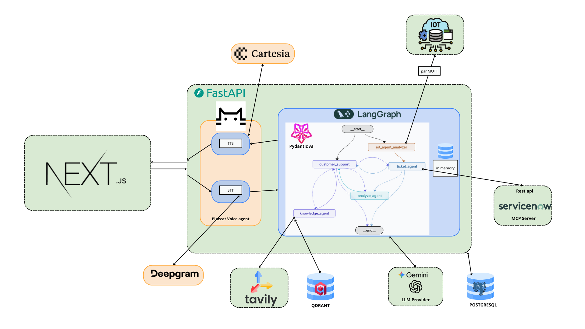
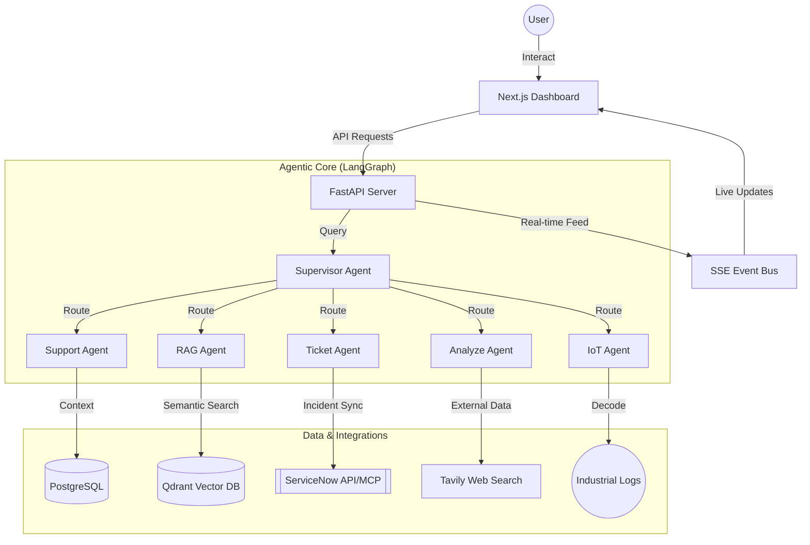

# GRID AI


A state-of-the-art multi-agent system for energy and utility management. This platform leverages LangGraph for complex reasoning, Pipecat for real-time voice interaction, and RAG for technical troubleshooting.
## Demonstration Video Link 
[Watch the project demonstration here](https://drive.google.com/drive/folders/1Ttes33AsuhNNjXWmZ4MwU71HV6Olsovk)
## Technical Features

- **Multi-Agent Orchestration**: Orchestrated by **LangGraph**, the system manages complex workflows between multiple specialized agents (Supervisor, Support, RAG, Ticket, Analyze, IoT).
- **Real-time Voice Interaction**: Integrated with **Pipecat**, providing low-latency, natural conversation capabilities using Deepgram for STT, Cartesia for TTS, and OpenAI/Gemini for reasoning.
- **Intelligent RAG**: Advanced Retrieval-Augmented Generation using **Qdrant** for vector storage and **Docling** for high-fidelity document parsing and hierarchical chunking.
- **Industrial IoT Integration**: Real-time telemetry processing via **MQTT** and **Paho-MQTT**, allowing the system to monitor and respond to industrial sensor data and logs.
- **Event-Driven UI**: A premium **Next.js** dashboard featuring server-sent events (SSE) for real-time agent activity tracking and live status updates.
- **Production Ready**: Fully containerized with **Docker**,and robust API documentation with **FastAPI**.

---

## Getting Started (Docker - Recommended)

The entire ecosystem (Postgres, Qdrant, Backend, and Frontend) is containerized for seamless deployment.

### 1. Prerequisites
- [Docker Desktop](https://www.docker.com/products/docker-desktop/) (Windows/macOS) or Docker Engine + Docker Compose (Linux).
- At least 4GB of RAM allocated to Docker.

### 2. Environment Setup
1. Copy the template to your local environment file:
   ```powershell
   # In the root directory
   cp .env.example .env
   ```
2. Open `.env` and fill in your mandatory API keys:
   - `OPENAI_API_KEY` (or `GEMINI_API_KEY`)
   - `DEEPGRAM_API_KEY` (for voice transcription)
   - `CARTESIA_API_KEY` (for voice synthesis)
   - `TAVILY_API_KEY` (for web search)

### 3. Launching the System
```bash
# Build and start all services in the background
docker-compose up -d --build
```

### 4. Access & Monitoring
- **Frontend Dashboard**: [http://localhost:3000](http://localhost:3000)
- **API Documentation**: [http://localhost:8000/docs](http://localhost:8000/docs)
- **Vector Store (Qdrant)**: [http://localhost:6333/dashboard](http://localhost:6333/dashboard)

### Common Docker Commands
| Action | Command |
| :--- | :--- |
| **View Logs** | `docker-compose logs -f` |
| **Stop Services** | `docker-compose stop` |
| **Down (Remove)** | `docker-compose down` |
| **Check Health** | `docker-compose ps` |
| **Rebuild Single Service** | `docker-compose up -d --build backend` |

---

##  Manual Development Setup

If you prefer to run services locally without Docker:

### 1. Prerequisites
- Python 3.10+
- Node.js 20+
- PostgreSQL & Qdrant running locally

### 2. Backend Setup
```bash
cd backend
python -m venv venv
# Windows
.\venv\Scripts\activate
# Unix/macOS
source venv/bin/activate

pip install -r requirements.txt
# Ensure backend/.env exists or use the root .env
python run_backend.py
```

### 3. Frontend Setup
```bash
cd frontend
npm install
npm run dev
```

---

## System Architecture

The AI Agent System is built on a high-concurrency event-driven architecture designed for real-time utility management.

### Architecture Overview


### Agentic Flow
The core logic is orchestrated using **LangGraph**, enabling dynamic state management and agent collaboration:



---

